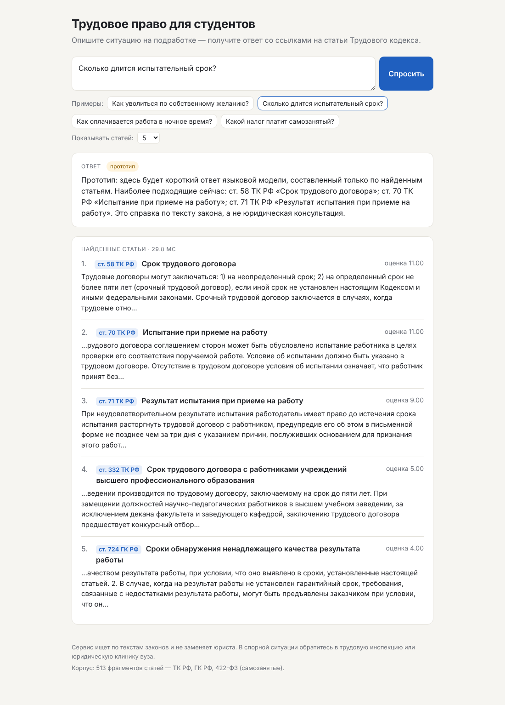

# Трудовое право для студентов

Веб-приложение для студентов, которые подрабатывают параллельно с учёбой.
Студент описывает ситуацию своими словами («не платят за испытательный срок»,
«не отпускают на сессию») и получает короткий ответ простым языком со ссылками
на статьи Трудового кодекса, Гражданского кодекса (договоры подряда и услуг)
и закона о самозанятых. Поиск — собственный индекс BM25, ответ — языковая
модель по найденным статьям (RAG).

НИРС по курсу ОАД, МГТУ им. Н. Э. Баумана, кафедра ИУ5, 2026.



## Запуск

Нужен Python 3.10+. Внешние библиотеки не нужны.

```bash
python -m app            # http://127.0.0.1:8000
python -m app --port 9000
```

Корпус `data/corpus.jsonl` уже собран. Пересобрать:

```bash
python scripts/fetch_laws.py     # нужен npm; выгружает тексты законов в data/raw/
python scripts/build_corpus.py   # статьи -> data/corpus.jsonl
```

## Основной сценарий

Описание ситуации → найденные статьи → ответ со ссылками «ст. N ТК РФ» и оговоркой,
что это не юридическая консультация. Подробно: [spec/product/scenarios.md](spec/product/scenarios.md).

## Проверка

```bash
python -m unittest -v
```

## Структура

```
README.md            запуск и сценарий
AGENTS.md            правила работы с репозиторием (для людей и кодинг-агента)
CHANGE_HISTORY.md    история изменений по контрольным точкам
spec/product/        пользователь, задача, сценарии, интерфейс
spec/tech/           архитектура, API, RAG и BM25, способ проверки
app/                 сервер, заглушки поиска и LLM, интерфейс (static/)
data/raw/laws.jsonl  тексты статей: ТК РФ, ГК РФ (подряд, услуги), 422-ФЗ
data/corpus.jsonl    корпус: 513 документов
scripts/             выгрузка законов, разбор актуальной редакции, сборка корпуса
tests/               тесты API
benchmark/           формат и черновик тестовых запросов
docs/                распределение работы, материалы к КТ1
```

## Данные

Тексты законов — из открытого набора `@ansvar/russian-law-mcp` (Apache-2.0,
источник — pravo.gov.ru). Тексты законов не являются объектом авторского права
(п. 6 ст. 1259 ГК РФ). В наборе ранние редакции; на КТ2 заменяем на актуальные.

## Команда

См. [docs/team.md](docs/team.md).
